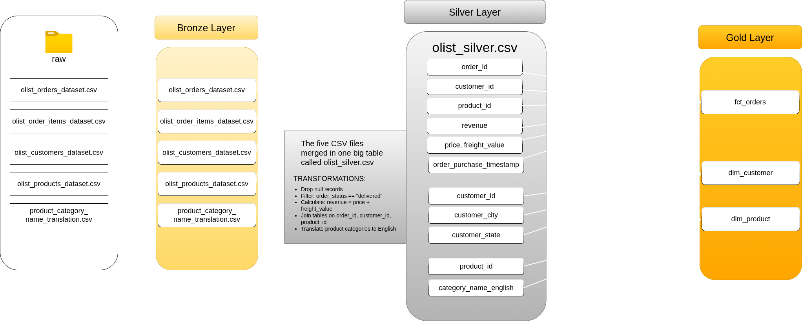
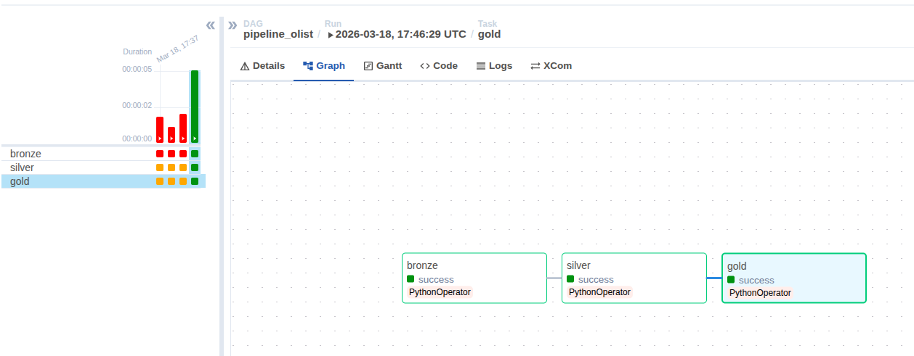

# Olist Data Pipeline

A production-style data pipeline that processes the [Olist Brazilian E-Commerce Dataset](https://www.kaggle.com/datasets/olistbr/brazilian-ecommerce) through a Medallion Architecture (Bronze → Silver → Gold), orchestrated by Apache Airflow running in Docker.

---

## The Problem

Raw e-commerce data arrives fragmented across multiple CSV files, without integration and with inconsistencies. Without a structured pipeline, an analyst would need to manually clean and join these files on every update — a slow, error-prone process that doesn't scale.

---

## The Business Question

> **What is the revenue by product category and by customer state?**

This question was chosen because it has real Brazilian business context, is answerable with the four selected tables, and produces a result any business manager can interpret.

Once the pipeline runs, the Gold layer is ready to answer it directly:

```sql
SELECT
    p.product_category_name_english,
    c.customer_state,
    ROUND(SUM(f.revenue), 2) AS total_revenue
FROM fct_orders f
JOIN dim_customer c ON f.customer_id = c.customer_id
JOIN dim_product p ON f.product_id = p.product_id
GROUP BY p.product_category_name_english, c.customer_state
ORDER BY total_revenue DESC
```

---

## Architecture



The pipeline is organized into three layers:

**🥉 Bronze** — Raw ingestion. The five CSV files are copied from `data/raw/` to `data/bronze/` without any modification. This layer exists for traceability: if something goes wrong downstream, it is always possible to return to the original data without re-downloading the dataset.

**🥈 Silver** — Cleaning and integration. The five files are read, cleaned, and joined into a single integrated DataFrame saved as `olist_silver.csv`. Transformations applied:
- Drop records with null values in essential fields
- Filter: only orders with `order_status == "delivered"`
- Calculate: `revenue = price + freight_value`
- Join tables on `order_id`, `customer_id`, and `product_id`
- Translate product categories to English

**🥇 Gold** — Star Schema. Three tables are extracted from the Silver layer and saved as CSVs in `data/gold/`:
- `fct_orders` — fact table with order_id, customer_id, product_id, revenue, price, freight_value, order_purchase_timestamp
- `dim_customer` — customer_id, customer_city, customer_state
- `dim_product` — product_id, product_category_name_english

---

## Pipeline in Action



The DAG `pipeline_olist` runs the three layers sequentially as individual tasks. Each task imports its corresponding function from `scripts/` and is triggered manually via the Airflow interface.

---

## Tech Stack

- Python + Pandas
- Apache Airflow 2.8.1
- Docker + Docker Compose
- Dataset: [Olist Brazilian E-Commerce](https://www.kaggle.com/datasets/olistbr/brazilian-ecommerce) (Kaggle)

---

## What I Learned Building This

The pipeline worked the same way with real data as it did with synthetic data from the previous project — which means the design was solid. A well-structured pipeline does not depend on the data being clean or predictable. It expects the mess and handles it in the right layer.

What Medallion Architecture actually solves is traceability. Processing everything at once is faster to write but impossible to debug. When something breaks, you need to know exactly where it broke. With Bronze as a frozen snapshot of the raw files, Silver as the cleaning and integration stage, and Gold as the business-ready output, every problem has a clear address.

The main friction in this project was the Docker environment on WSL2. Permission errors on mounted volumes required manual `chmod` on `data/` and `logs/` folders, and `shutil.copy2` failed because WSL restricts metadata operations on Docker-mounted paths. The fix was replacing it with direct binary read/write. These are the kinds of problems that don't appear in tutorials but are real in production environments.

For a version 2, I would:
- Replace CSV storage with a database (PostgreSQL or DuckDB) at the Silver and Gold layers
- Add data quality tests with Great Expectations at the Silver layer
- Fix Docker volume permissions properly using UID configuration in `docker-compose.yaml` instead of `chmod`
- Add a `download.py` script to automate dataset download via the Kaggle API

---

## How to Run

**1. Clone the repository**
```bash
git clone git@github.com:lume-workflow/olist-pipeline.git
cd olist-pipeline
```

**2. Download the dataset**

Download the Olist dataset from [Kaggle](https://www.kaggle.com/datasets/olistbr/brazilian-ecommerce) and place the following five files in `data/raw/`:

```
olist_orders_dataset.csv
olist_order_items_dataset.csv
olist_customers_dataset.csv
olist_products_dataset.csv
product_category_name_translation.csv
```

**3. Set folder permissions**
```bash
mkdir -p logs
sudo chmod 777 logs
sudo chmod -R 777 data/
```

**4. Initialize Airflow**
```bash
docker compose up airflow-init
```

**5. Start Airflow**
```bash
docker compose up webserver scheduler -d
```

**6. Trigger the pipeline**

Open [http://localhost:8080](http://localhost:8080) in your browser (login: `admin` / `admin`), find the `pipeline_olist` DAG, and click **Trigger DAG**.

---

## Author

- GitHub: [github.com/lume-workflow](https://github.com/lume-workflow)
- LinkedIn: [linkedin.com/in/lume-workflow](https://linkedin.com/in/lume-workflow)
